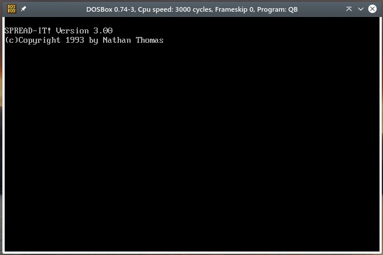
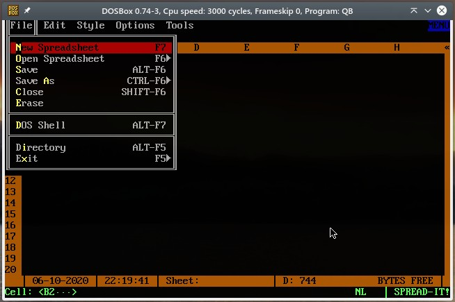
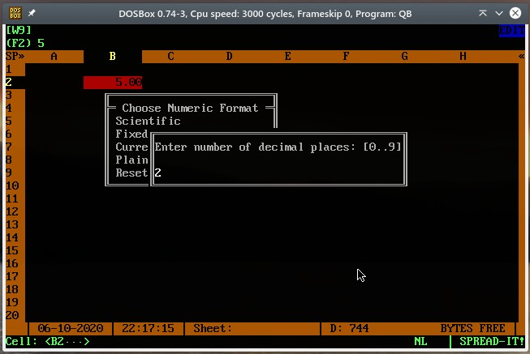
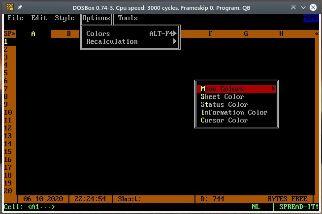
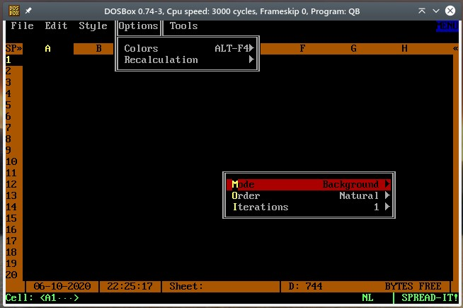

qbasic-spreadit

Okay, okay -- the name is terrible, but remember the days when all you had wer 8 character file names in DOS? yah. So, this is what we get.

This was a personal project in 1993. I always found it really important to put copyrighted dates in my software, for some reason. This is also labeled as version 3, but that ain't right. Just makin' stuff up :)

This thing actually worked although it was terribly terribly slow (let's wonder why). There were some weird bugs that I recall with editing information in cells, but for the most part I was really pleased with how this turned out.

I think the initial draw and "un-draw" of the spreadsheet is purposefully delayed so I could make it seem like "work" was being done. I liked the way that other spreadsheet programs took their time to draw the cell frames and UI elements. I guess that's what passed for "real software" at the time. Extra slow even when it didn't have to be.

Anyhoo. This required a special library called `ADVBAS.QLB` either to run properly, or to compile properly. I think it was required for compilation. As I have NO idea the license requirements on this file, I won't be including it in the repo here. /shrug

Here's some screens! Running for the first time in almost 30 years using **ORIGINAL QB 4.5 EXECUTABLE!**. I still had this in my archive. With DOSBox, the executable and library ran flawlessly.

